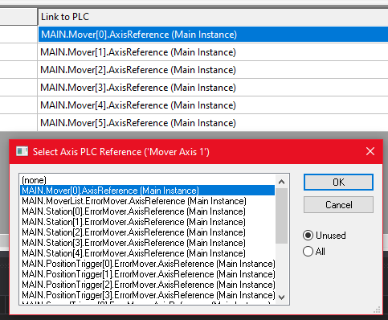

# ErrorMovers

## Invalid References

Objectives that return References to MoverLists or Movers have the potential to return *invalid* references. For example, a Station with no mover present can't possibly return a CurrentMover, because by definition no CurrentMover exists! To prevent this, it is important to ensure that all *CurrentMover* and *CurrentMoverList* output properties are only evaluated when a *MoverInPosition*, *MoverPassedPosition*, *MoverInVelocity*, etc. flag is true for the relevant Objective.

```javascript
// There is no CurrentMover at the Station, so this code will not operate correctly!!
IF Station[1].MoverInPosition = FALSE THEN
	Station[1].CurrentMover.MoveToPosition( 200 );
END_IF
```

Typically, calling methods on these *invalid references* would result in a Pagefault and halt the XAR. However this outcome can be frustrating and slows development. Instead, an imposter **ErrorMover** object is returned in these circumstances as a quality-of-life improvement. ErrorMovers replace all the method functionality of standard Movers and will instead generate Errors in TwinCAT. For example:


## Axis Linking

ErrorMovers contain AXIS_REFERENCEs and will appear in the list of potential linkable objects when connecting NC Axes to PLC axes. Be sure to avoid accidentally linking these ErrorMover objects, or the project will not operate correctly.


