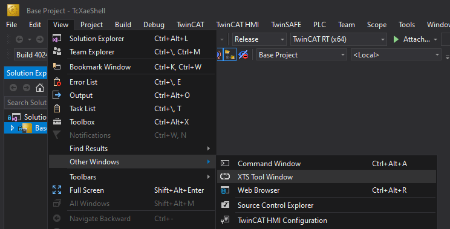
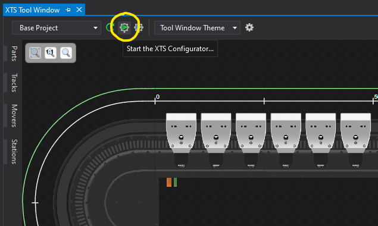
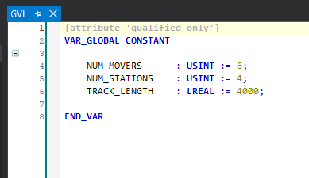
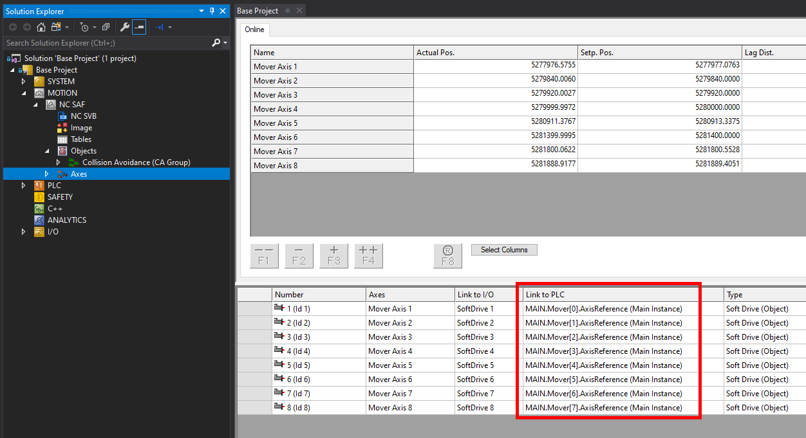
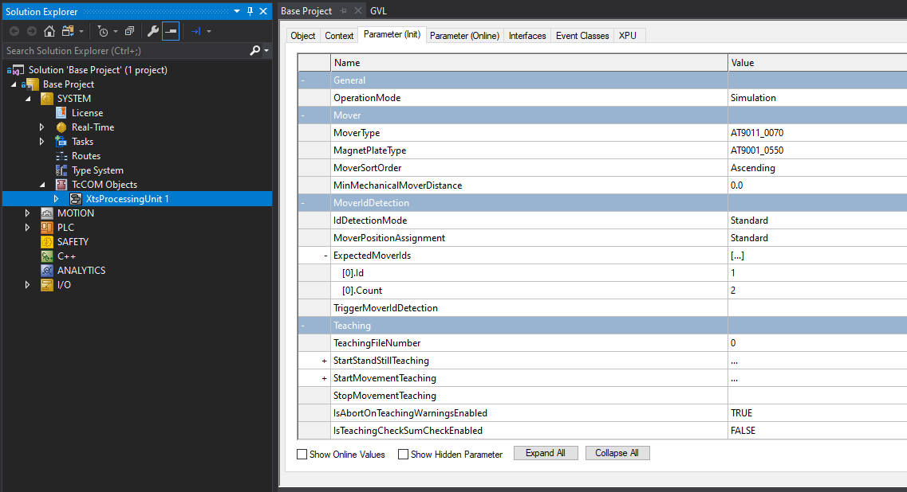

# Getting Started

## Project Requirements

For new projects, the latest versions of TwinCAT and XTS software should be utilized.

All XTS projects will require:

- [TF5850](https://www.beckhoff.com/en-en/products/automation/twincat/tfxxxx-twincat-3-functions/tf5xxx-tc3-motion-control/tf5850.html)
- [TF5410](https://www.beckhoff.com/en-en/products/automation/twincat/tfxxxx-twincat-3-functions/tf5xxx-tc3-motion-control/tf5410.html)

## Configuring XTS Hardware

The base project includes a simulated configuration for a 4m oval track and 6 movers. In order to modify the program to fit a different track configuration, navigate to the XTS Tool Window.

Then launch the XTS Configurator and follow the prompts to configure your system.

>The configurator occasionally conflicts with existing settings in the project. To avoid this, it can help to delete the following prior to running the XTS Configurator:

> - XtsProcessingUnit
- All Mover Axis Object
- Existing XTS_Task
- Any hardware in the IO section.

## Initialization Settings

Once your hardware configuration is set, you will need to change a few variable parameters in the code to match the system.

Inside *MOTION > Objects > Collision Avoidance (CA Group)*, set the **Rail Length** parameter to match your hardware.

Next, open the GVL file within PLC and modify these constants to match your system.

Next, check that each of your Axis objects are properly linked to a corresponding Mover object.

Lastly, open the *XtsProcessingUnit* within SYSTEM and verify that every setting here is correct

